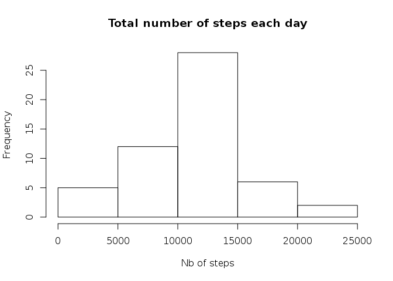
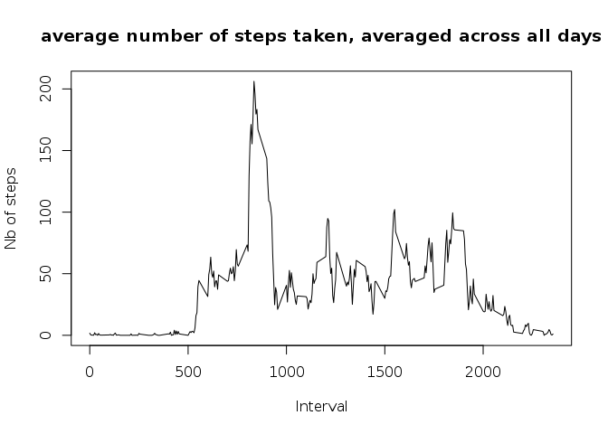
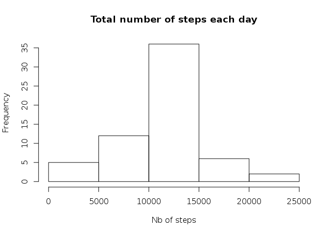
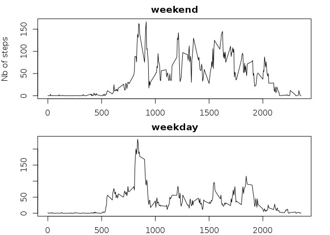

# Reproducible Research: Peer Assessment 1


## Loading and preprocessing the data

To get the weekdays in english:

```r
Sys.setlocale(category="LC_TIME",locale="en_US.utf8")
```

Loading and transforming the date col into proper date

```r
act<-read.csv("activity.csv",stringsAsFactors = FALSE)
#act<- transform(act,date = strptime(date,"%Y-%m-%d"))
```
## What is mean total number of steps taken per day?

```r
sumsteps <- aggregate(act$steps,list(act$date),sum)

hist(sumsteps$x,main="Total number of steps each day",xlab="Nb of steps")
```

 

```r
meanstep   <- mean(sumsteps$x,na.rm=TRUE)
medianstep <- median(sumsteps$x,na.rm = TRUE)
```
Mean  total number of steps taken per day : **1.0766189\times 10^{4}**

Median  total number of steps taken per day : **10765**


## What is the average daily activity pattern?

```r
steps_int<- split(act,act$interval)
avg<- sapply(steps_int,FUN=function(x) { y<- mean(x$step,na.rm=TRUE)   })
avg_step<- cbind(as.numeric(names(avg)),unname(avg))
plot(avg_step,type="l",main="average number of steps taken, averaged across all days",xlab="Interval",ylab="Nb of steps")
```

 

```r
max_step <- avg_step[which.max(avg_step[,2])]
```

5-minute interval containing , on average across all the days in the dataset, the maximum number of step : **835**


## Imputing missing values

```r
missing_values <- table(complete.cases(act$steps))["FALSE"]
```

Missing values in the dataset : **2304**

Example :

```r
head(act)
```

```
##   steps       date interval
## 1    NA 2012-10-01        0
## 2    NA 2012-10-01        5
## 3    NA 2012-10-01       10
## 4    NA 2012-10-01       15
## 5    NA 2012-10-01       20
## 6    NA 2012-10-01       25
```

Filling in the missing values with the mean per interval  :

```r
idx <- 1
act_nna <- act
mean_per_interval <- data.frame(avg)
for (i in act_nna[,1]) {
  if (is.na(i[1])) 
  {
    x<- act_nna[idx,3]
    act_nna[idx,1] <- mean_per_interval[as.character(x),]
  }  
  idx <- idx+1
  
}
```

Example:

```r
head(act_nna)
```

```
##       steps       date interval
## 1 1.7169811 2012-10-01        0
## 2 0.3396226 2012-10-01        5
## 3 0.1320755 2012-10-01       10
## 4 0.1509434 2012-10-01       15
## 5 0.0754717 2012-10-01       20
## 6 2.0943396 2012-10-01       25
```


```r
sumsteps_nna <- aggregate(act_nna$steps,list(act_nna$date),sum)
hist(sumsteps_nna$x,main="Total number of steps each day",xlab="Nb of steps")
```

 

```r
meanstep<- mean(sumsteps_nna$x)
medianstep<- median(sumsteps_nna$x)
```
Mean  total number of steps taken per day : **1.0766189\times 10^{4}**

Median  total number of steps taken per day : **1.0766189\times 10^{4}**

## Are there differences in activity patterns between weekdays and weekends?


```r
act_nna<- transform(act_nna,date = strptime(date,"%Y-%m-%d"))
act_nna_w<-cbind(act_nna,!is.element(weekdays(act_nna$date), c("Saturday","Sunday")),is.element(weekdays(act_nna$date), c("Saturday","Sunday")))
names(act_nna_w) <- c("steps","date","interval","weekday","weekend")


steps_int_weekday<- split(act_nna_w[act_nna_w$weekday,],act_nna_w[act_nna_w$weekday,]$interval)
steps_int_weekend<- split(act_nna_w[act_nna_w$weekend,],act_nna_w[act_nna_w$weekend,]$interval)

avg_weekday<- sapply(steps_int_weekday,FUN=function(x) { y<- mean(x$step)   })
avg_weekend<- sapply(steps_int_weekend,FUN=function(x) { y<- mean(x$step)   })

avg_step_weekday<- cbind(as.numeric(names(avg_weekday)),unname(avg_weekday))
avg_step_weekend<- cbind(as.numeric(names(avg_weekend)),unname(avg_weekend))


split.screen(c(2, 1),erase=TRUE)
```

```
## [1] 1 2
```

```r
#c(bottom, left, top, right)
par(mar=c(2,4,2,2))
plot(avg_step_weekend,type="l",main="weekend",ylab="Nb of steps",xlab="")
screen(2)
par(mar=c(2,4,2,2))
plot(avg_step_weekday,type="l",main="weekday",xlab="Interval",ylab="")
```

 
